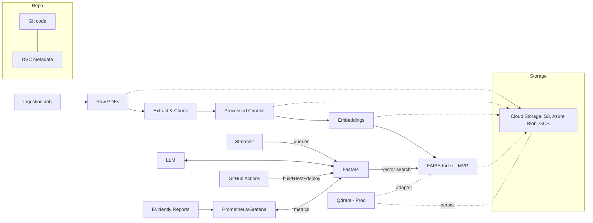

# Project Proposal - “What do they say? (An MLOps-First RAG System)”

## 1. Project Title
**What do they say? - Quote Retrieval for NGO Position Papers (An MLOps-First RAG System)**

## 2. Summary
### Goal:  
The goal is to develop the MVP into a production-grade, MLOps-first RAG system that ingests public NGO documents (e.g., Greenpeace, WWF), retrieves verifiable quotes with page-accurate citations, and exposes them via an API plus a lightweight UI for journalists and policy analysts.

### Problem:  
Positions of NGOs are scattered across PDFs and reports; finding reliable, citable sentences is slow and error-prone.

### Primary Users:  
- Journalists  
- Policy researchers  
- NGO comms/advocacy teams

### Core Value:
Fast, auditable answers with exact quotes and sources; full traceability for editorial and compliance workflows.

### MLOPs Implementation:
This project upgrades a working local RAG MVP into a **production-ready, MLOps-centric system** for retrieving **verifiable quotes** from public NGO documents. The current prototype ingests PDFs, chunks text, computes embeddings (SentenceTransformers), retrieves via a vector store, optionally re-ranks, applies MMR for diversity, and produces answers with **per-bullet citations** (`[Doc p.X]`).  
We will make the system **reproducible, observable, and continuously deployable**: **DVC** for data/artifact lineage, **Docker** for containerization, and **GitHub Actions** for CI/CD with automated **retrieval quality gates** (Recall@k, nDCG) on a curated golden set. **Prometheus/Grafana** provide runtime monitoring; **Evidently** generates drift reports for inputs/outputs; **MLflow** tracks experiments, parameters, metrics, and artifacts.  
Deployments are **cloud-first** (e.g. **Google Cloud Run**, **Fly.io**), with a modular vector-store **adapter** supporting **FAISS (local)** and **Qdrant (cloud/production)**.
The system completes the RAG loop by using an **LLM** (currently via the **OpenAI API**) to generate concise, source-cited answers from the top-retrieved document chunks. This enables users to get ready-to-use, quote-level outputs directly from their queries, rather than just a list of matching snippets. A **lightweight Streamlit UI** is provided for interactive querying and exploration, making the system accessible to journalists and analysts with no coding required.

#### Expected impact: 
Sharply reduced lead time for corpus updates, measurable reliability via automated gates, full response traceability, and a reusable blueprint applicable to newsrooms, policy analysis, and knowledge bases. 

## 3. MLOps Context and Challenge
- **Existing model (overview):**  
  PDFs → clean & chunk → SentenceTransformers embeddings → vector search (FAISS; Qdrant planned) → optional cross-encoder re-rank → MMR → LLM (OpenAI API) generates answers with strict source citations

- **Current challenges:**  
  - **Reproducibility:** Manual data handling and no tracking of data and artifacts across pipeline steps.
  - **Updating/versioning:** No fully automated, end-to-end pipeline (from PDF ingestion to embedding and index update).
  - **Deployment:** No standardized, containerized API/UI or CI/CD; no cloud environments
  - **Monitoring:**  
    Centralized metrics and automated drift checks are not yet implemented; currently, performance checks are subjective and manual.
  - **User interface/accessibility:**  
    No user-friendly interface yet—queries are currently entered directly in code or notebooks, making the system inaccessible for non-technical users.
  - **Team collaboration:**  
  No support for collaborative workflows; secrets/config management and versioning practices are currently not implemented.

- **Why MLOps:**  
  Robust MLOps practices ensure that the retrieval system is reproducible, automatable, and maintainable. Without clear data lineage, automation, and monitoring, the risk of regressions and unreliable answers increases, especially as the project scales or the document corpus grows.

## 4. MLOps Project Objectives
1. **Reduce corpus-to-production lead time** via automated ingestion, validation, indexing, and deploy.  
2. Reach **≥80% automation** across ingestion, validation, embedding, index build, testing, and deployment.  
3. **Drift detection**: Monitor for input and retrieval drift via automated Evidently reports (alerting/automation as future extension).  
4. Enforce CI **quality gates**: Optimize retrieval (recall/ranking) with metrics like Recall@10 and nDCG@10 on a golden query set (fail builds below thresholds). 
5. Achieve **100% response traceability** (query, prompt, model versions, index hash, chunk/page IDs) logged per API answer.
6. Develop and document a **standardized API** and a user-friendly **Streamlit interface**, enabling direct access to the system for non-technical users (e.g., journalists, analysts).

## 5. MLOps Technical Architecture
- **Data & artifacts:** **DVC** for raw → processed → embeddings → index.  
- **Vector store (adapter):** **FAISS** for local prototyping; **Qdrant** for cloud/production.
- **Storage layout (MVP → Prod):**
  - **Raw documents (PDFs):** Cloud Storage (object storage, e.g., AWS S3, Azure Blob, GCP Cloud Storage) as DVC remote to keep GitHub/Streamlit lean.
  - **Processed chunks & metadata:** Stored + versioned in Cloud Storage via DVC.
  - **Embeddings:** Persisted as `.npy`/Parquet in Cloud Storage, tracked with DVC.
  - **Index (FAISS, MVP):** Versioned artifact in Cloud Storage via DVC (pulled on deploy).
  - **Vector store (Prod):** Qdrant (managed/cloud) as primary store; Cloud Storage remains source-of-truth + cold backups.
  - **Local caches:** Ephemeral cache on API/Streamlit services for runtime speed; rebuild from Cloud Storage/DVC when needed.
- **Serving:** **FastAPI** (`/search`, `/answer`, `/health`) + **Streamlit** UI.  
- **Containerization & CI/CD:** **Docker** (+compose for dev), **GitHub Actions** (lint/test → DVC pull → index build → golden-set eval → image build/push → deploy to Cloud Run/Fly.io).  
- **Observability:** **Prometheus** metrics → **Grafana** dashboards (requests, p50/p95 latency, error rate).  
- **Drift & data quality:** **Evidently** offline HTML reports (daily/per update).  
- **Experiment tracking:** **MLflow** (runs, params, metrics, artifacts).  
- **Secrets:** GitHub Secrets / `.env` in dev.
- **Generation (LLM):** Uses the OpenAI API to generate natural-language answers based on the retrieved document chunks, including strict per-source citations.
- **UI:** A simple Streamlit app allows users to query the system, view retrieved quotes, and copy fully-formatted answers for their workflows.
- **Optional/Stretch:** **Qdrant as primary store in cloud**, **Airflow** for DAG orchestration (DVC remains sufficient for MVP), **Weights & Biases** as alternative tracker.

**Architecture (Mermaid)**

## 6. GitHub POC and Data Sources
- **GitHub POC:** **Existing MVP repository** (local RAG prototype). It will be evolved during the project to include DVC tracking, CI quality gates, Dockerized serving, and cloud deployment.  
- **Data sources (free & public):**  
  - Official NGO publications/report pages (e.g., Greenpeace, BUND, WWF, Amnesty).  
  - Optional context: EU/UN open policy documents.  
  - Only documents clearly public; store license/source metadata.

## 7. Risk Assessment and Mitigation Strategies
- **Licensing/ToS:**  
  Some PDFs may restrict automated processing; limit ingestion to clearly public documents, record license/source metadata, and respect robots.txt.
- **OCR/quality variance:**  
  Low-quality scans may reduce retrieval accuracy; use OCR as fallback, set minimum text/charset quality checks, and flag problematic documents.
- **LLM cost/limits:**  
  Potential API costs or rate limits; cache development answers, run retrieval-only tests when possible, and allow for local LLM use in development.
- **Infrastructure complexity:**  
  Avoid unnecessary complexity—baseline setup uses Docker-compose and Cloud Run (if cloud deployment is needed). Orchestration tools (e.g., Airflow, Kubernetes) are **not** part of the MVP and reserved as stretch goals for future scaling.
- **Evaluation effort:**  
  Golden query set curation (e.g., 20–50 queries) is manual and time-intensive; start with a small set and expand iteratively as the system grows.

## 8. Success Metrics
- **Deployment lead time (PDFs → prod index):**  
  < 10 minutes for current MVP setup; designed to remain efficient as corpus size grows.
- **Update frequency (manual ingestion):**  
  Updates are currently triggered manually; automation-ready for future continuous document ingestion.
- **Automation rate:**  
  ≥ 80% of pipeline steps (ingestion, validation, indexing, deployment) are fully automated.
- **Retrieval quality gates:**  
  Recall@10 ≥ 0.80; nDCG@10 ≥ 0.75 on curated golden query set (measured after each pipeline run).
- **Traceability:**  
  100% of API responses include artifact/version metadata (source document, chunk/page ID, model version, index hash).
- **Drift monitoring:**  
  Framework for data drift detection is in place for future scenarios with automated, continuous ingestion. For the current MVP, drift is monitored but not expected due to manual updates.

## 9. Potential for Integration into the Projects Catalog
- **Covered MLOps skills:** DVC lineage, Dockerized serving, CI/CD with quality gates, cloud deployment (Cloud Run/Fly.io), runtime monitoring (Prometheus/Grafana), drift evaluation (Evidently), experiment tracking (MLflow), modular vector store (FAISS/Qdrant).  
- **Applicability:** Blueprint for RAG/search in compliance, support, policy analysis, and knowledge bases.  
- **Evolution:** Optional extensions (Qdrant primary in cloud, Airflow orchestration, W&B tracking) make it easy to scale the project’s sophistication.

## 10. Conclusion
“What do they say?” evolves a local RAG MVP into a robust, transparent, and extensible production workflow. By utilizing the strengths of a fully integrated MLOps approach - including data and artifact versioning, automated deployment, reproducible pipelines, and comprehensive observability - the project ensures reliable, auditable answers and fast iteration. The design stays aligned with the DataScientest curriculum while making modern features (like Qdrant integration and cloud deployment) easy to adopt and extend.

